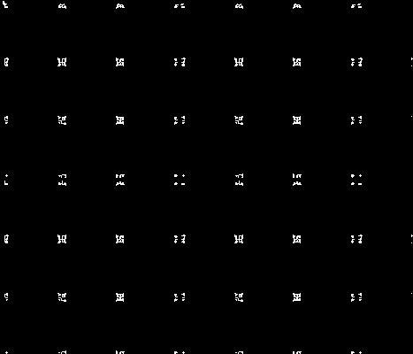

**Commands And Examples**
- On this section you will find some examples of how to use some of the algorithms and  and their outputs as well.</br></br>
   **Reading an Image**</br></br>
   **Input Image**</br>
   </br></br>
   ```
   Image imag("image2.png");//by the Image source
   ```
   **Constrast Stretching**</br>
   ```
   Image image_cont = imag.ContrastStretch();
   image_cont.display(); //displaying the image
   image_cont.save(); //saving the image
   ```
    **Output**</br>
   </br></br>
   
   **Median filter**</br>
   **Input**</br>
   </br></br>
   
   ```
   Image image_med = imag.median();
   image_med.display();
   image_med.save();
   ```
   **Output**</br>
   </br>
   
   **Edge Detection**</br>
   ```
   Image imagX = imag.edgeDetect("sobelX"); // Sobel By dx
   imagX.display();
   imagX.save();
   
   Image imagY = imag.edgeDetect("sobelY");//Sobel By dy
   imagY.display();
   imagY.save();

   Image imagM = imag.edgeDetect("sobelM");//Sobel magnitude
   imagM.display();
   imagM.save();
   
   Image imagL = imag.edgeDetect("laplac");
   imagL.display();
   imagL.save();
   ```
   **Outputs:**</br></br>
   **SobelX:**</br>
   </br></br>
   **SobelY:**</br>
   </br></br>
   **SobelM:**</br>
   </br></br>
   **Laplac:**</br>
   </br></br>
   
   **Corner Detection**</br>
   **Input**</br>
   </br></br>
   
   ```
   Image imag2 = imag.corners();
   imag2.display();
   imag2.save();
   ```
   **Output**</br>
   </br></br>
